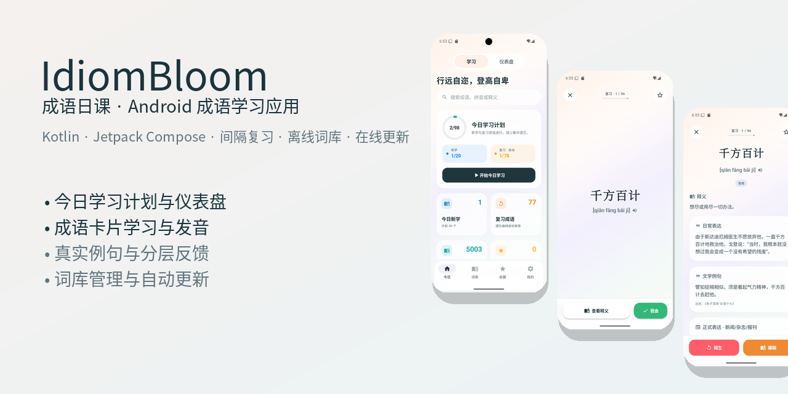
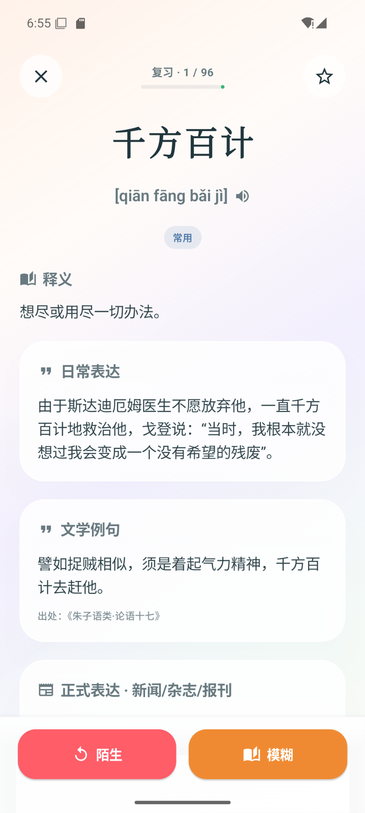
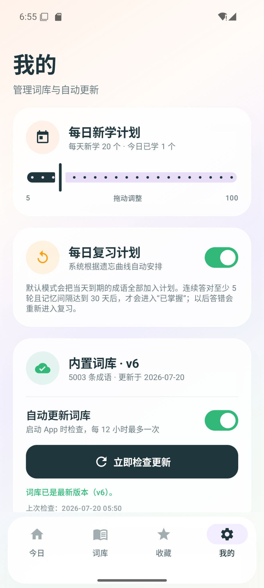

# IdiomBloom — 成语日课 Android 版

<p align="center">
  
</p>

<p align="center">
  一款基于 <strong>Kotlin</strong> 与 <strong>Jetpack Compose</strong> 开发的 Android 成语学习应用。
  <br />
  支持每日新学计划、基于遗忘曲线的复习安排、真实例句、语音朗读、离线词库与在线更新。
</p>

<p align="center">
  Chinese idiom learning app for Android with spaced repetition, pronunciation, example sentences,
  learning statistics, offline dictionaries, and online updates.
</p>

---

## 应用预览

<p align="center">
  
  
  
</p>

<p align="center">
  <strong>今日学习</strong>
  &nbsp;&nbsp;&nbsp;&nbsp;&nbsp;&nbsp;&nbsp;&nbsp;&nbsp;&nbsp;&nbsp;
  <strong>学习卡片</strong>
  &nbsp;&nbsp;&nbsp;&nbsp;&nbsp;&nbsp;&nbsp;&nbsp;&nbsp;&nbsp;&nbsp;
  <strong>释义与例句</strong>
</p>

<p align="center">
  
  
</p>

<p align="center">
  <strong>学习仪表盘</strong>
  &nbsp;&nbsp;&nbsp;&nbsp;&nbsp;&nbsp;&nbsp;&nbsp;&nbsp;&nbsp;&nbsp;
  <strong>词库与计划设置</strong>
</p>

## 操作演示

<p align="center">
  
</p>

---

## 主要功能

### 学习与复习

- 每日新学数量可自由调整
- 自动把到期成语加入当天复习计划
- 根据学习反馈动态安排后续复习
- 连续多轮正确后进入“已掌握”
- 答错或记忆模糊的成语重新进入复习
- 新学内容与复习内容穿插进行

### 成语学习卡片

- 初始仅展示成语与拼音，避免提前看到答案
- 支持“查看释义”和“我会”两条学习路径
- 根据回答显示“我会了、记错了、陌生、模糊”等反馈
- 支持中文语音朗读
- 支持收藏与取消收藏
- 展示释义、易错提示、日常表达、文学例句和正式表达例句

### 学习统计

- 今日新学数量
- 今日复习数量
- 累计掌握数量
- 累计复习数量
- 连续学习天数
- 当前待复习数量
- 近期学习趋势

### 词库与搜索

- 内置 5000+ 条成语
- 支持成语、拼音和释义搜索
- 支持高频常用与易错专题筛选
- 支持收藏列表
- 支持完全离线使用
- 支持 HTTPS 在线词库更新

### 在线更新安全校验

下载新词库前会检查：

- 词库版本
- SHA-256 校验值
- JSON 格式
- 成语条目数量

校验失败时保留原词库，避免损坏本地学习数据。

---

## 技术栈

- Kotlin
- Jetpack Compose
- Material 3
- AndroidX
- Kotlin Coroutines
- Android TextToSpeech
- SharedPreferences
- Gradle Kotlin DSL

---

## 系统要求

- 最低 Android 版本：Android 8.0，API 26
- 目标 Android 版本：Android 16，API 36
- JDK：17
- Android Studio：支持 Android Gradle Plugin 8.13.0 的版本
- Android SDK：36

---

## 快速开始

### 使用 Android Studio

1. 克隆或下载本项目。
2. 在 Android Studio 中打开项目根目录。
3. 等待 Gradle 同步完成。
4. 确认已安装 JDK 17 和 Android SDK 36。
5. 创建或选择 API 26 以上的模拟器。
6. 运行 `app` 配置。

### 使用命令行构建

Windows：

```text
gradlew.bat assembleDebug
```

macOS 或 Linux：

```text
./gradlew assembleDebug
```

调试 APK 生成位置：

```text
app/build/outputs/apk/debug/app-debug.apk
```

---

## 项目结构

```text
IdiomBloom-Android/
├─ app/
│  ├─ src/main/
│  │  ├─ assets/
│  │  │  ├─ idioms.json
│  │  │  └─ dictionary_meta.json
│  │  ├─ java/com/idiombloom/app/
│  │  │  ├─ data/
│  │  │  ├─ ui/
│  │  │  └─ MainActivity.kt
│  │  ├─ res/
│  │  └─ AndroidManifest.xml
│  └─ build.gradle.kts
├─ docs/images/
├─ gradle/wrapper/
├─ server-example/
├─ tools/
├─ build.gradle.kts
├─ settings.gradle.kts
├─ gradle.properties
├─ THIRD_PARTY_NOTICES.md
└─ README.md
```

---

## 扩充本地成语词库

内置词库文件：

```text
app/src/main/assets/idioms.json
```

文件最外层为 JSON 数组，每条成语使用如下结构：

```json
{
  "id": "shuo-guo-lei-lei",
  "text": "硕果累累",
  "pinyin": "shuò guǒ léi léi",
  "tone": "positive",
  "meaning": "本指果实繁多，常比喻取得了很多显著成果。",
  "note": "“累累”在这里读 léi léi。",
  "example": "经过几年的潜心研究，团队硕果累累。",
  "contextExample": "成果展呈现了同学们一年来硕果累累的创作实践。",
  "tags": ["成果", "褒义", "易错读音"]
}
```

字段说明：

| 字段 | 含义 |
|---|---|
| `id` | 稳定且唯一的英文标识，发布后不建议修改 |
| `text` | 成语正文 |
| `pinyin` | 带声调拼音 |
| `tone` | `positive`、`neutral` 或 `negative` |
| `meaning` | 成语释义 |
| `note` | 易错字、易错读音或使用提示 |
| `example` | 日常表达例句 |
| `contextExample` | 文学、新闻、杂志或报刊等正式语境例句 |
| `tags` | 搜索、频率和专题分类标签 |

修改 JSON 后重新构建 App，即可更新内置词库，无需修改 Kotlin 代码。

---

## 配置在线词库更新

项目已经包含在线更新逻辑和可部署示例：

```text
server-example/
```

在根目录的 `gradle.properties` 中设置远程清单地址：

```properties
IDIOM_DICTIONARY_MANIFEST_URL=https://abrikk.github.io/idiom-dictionary/manifest.json
```

构建后，该地址会写入安装包。App 启动或回到前台时可自动检查更新，用户也可以在“我的”页面手动检查。

### 发布新版词库

1. 准备完整的新词库 JSON。
2. 计算词库文件的 SHA-256。
3. 更新 `manifest.json` 中的版本、日期、下载地址、校验值和条目数。
4. 先上传词库 JSON。
5. 最后上传 `manifest.json`。

详细字段与部署方式见：

```text
server-example/README.md
```

---

## 数据存储与隐私

- 学习进度、收藏状态和复习计划保存在设备本地
- 在线词库保存在 App 私有目录
- App 不要求注册账号
- App 不上传用户的学习记录
- 删除 App 后，本地学习数据会随应用数据一同清除

---

## 数据来源与许可

当前词库由公开词库、频率数据和人工整理内容合并生成，主要参考：

- THUOCL：清华大学开放中文词库
- chinese-xinhua
- IdiomBloom 人工整理的易错分类、提示和部分例句

具体来源、许可说明和注意事项见：

```text
THIRD_PARTY_NOTICES.md
```

正式商业发布前，仍建议逐条复核成语释义、例句准确性及内容授权。

---

## 后续计划

- 完善基于遗忘曲线的复习策略
- 增加更丰富的学习趋势统计
- 优化平板和大屏适配
- 增加词库版本历史与回退功能
- 持续校对成语释义、例句与出处
- 增加更多易错专题和近义成语辨析

---

## 贡献

欢迎通过 Issues 提交：

- Bug 报告
- 交互和界面建议
- 成语内容纠错
- 例句与出处补充
- 新功能建议

提交词库修改时，请确保：

- 成语 `id` 唯一且稳定
- JSON 格式正确
- 例句自然、准确
- 文学与正式例句标注可靠出处
- 不包含受限制或来源不明的长篇版权内容

---

## 项目状态

项目仍在持续开发和内容校对阶段。当前版本适合学习、测试和功能演示；正式上架应用商店前，还需要继续进行内容审核、设备兼容测试和发布配置检查。

